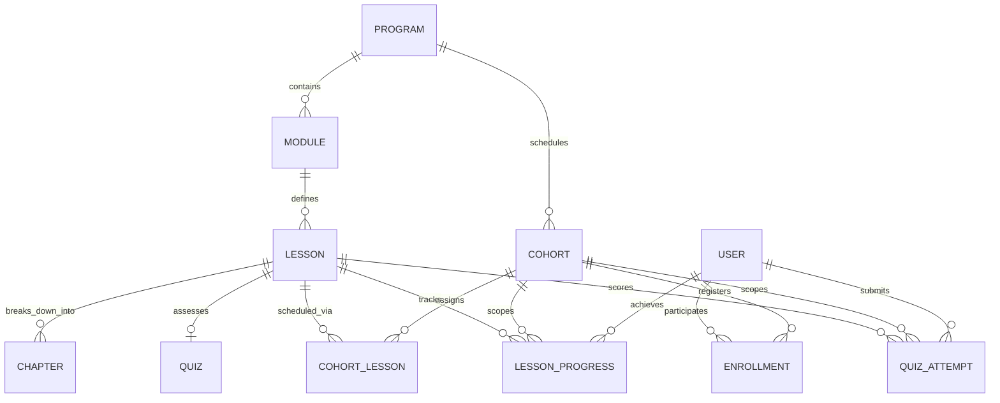
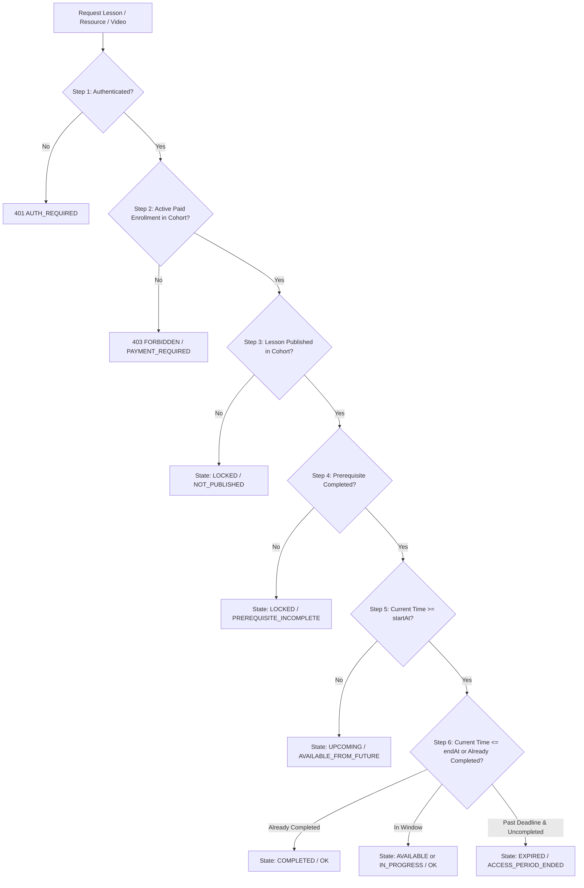

# ILSI LMS: Decoupled Content & Cohort Architecture

## 1. Architectural Overview

The Institute for Leadership and Social Impact (ILSI) Learning Management System is designed with an enterprise-grade, decoupled content architecture separating educational curriculum definitions from cohort delivery schedules.

---

## 2. Core Entities & Responsibilities

### 2.1 Program
- **Container**: Top-level educational curriculum container (`programs`).
- **Reusable**: Independent of calendar dates. Holds localized title (`title_en`, `title_fr`), description, duration in weeks, pricing (`price` USD, `price_eur` EUR), and thumbnail.
- **Scope**: Serves as the curriculum blueprint across multiple recurring cohorts.

### 2.2 Cohort
- **Delivery**: Operational instance of a program (`cohorts`).
- **Schedule**: Defines the overall calendar window (`start_date`, `end_date`, `timezone`), capacity, admissions settings, participant fees, and live session Google Calendar integrations.
- **Separation**: Multiple cohorts can run concurrently or sequentially against the same program blueprint without content duplication.

### 2.3 Module & Lesson
- **Pedagogical Structure**:
  - `modules`: Thematic sections belonging to a `program` (`order_index`, `title_en`, `title_fr`, `estimated_hours`, `passing_score`).
  - `lessons`: Atomic learning units (`type`: `VIDEO`, `TEXT`, `CASE_STUDY`, `INTERACTIVE_ACTIVITY`, `PDF`, `RESOURCE`). Independent of cohort dates.
  - `chapters`: Micro-learning sequential subsections within a lesson for granular tracking and video timestamps.
- **Safety Guarantee**: Content is authored once. Updating lesson video or body text updates the master curriculum without mutating active cohort schedules or corrupting historical progress.

### 2.4 CohortLesson (Assignment Entity)
- **Table**: `cohort_lessons` (unique constraint on `cohort_id` + `lesson_id`).
- **Responsibilities**: Defines *when* and *under what conditions* a reusable lesson is available to participants in a specific cohort:
  - `start_at`: Absolute timestamp when the lesson opens.
  - `end_at`: Absolute timestamp when the lesson closes / expires.
  - `order_index`: Cohort-specific sequence number.
  - `prerequisite_lesson_id`: Lesson ID required to be completed before this lesson unlocks.
  - `passing_score`: Cohort-specific passing threshold (overriding default if needed).
  - `is_required` & `is_published`: Granular visibility toggles.

### 2.5 Participant Progress & Quiz Attempts
- **Cohort-Scoped Tracking**:
  - `lesson_progress`: Composite primary key/unique constraint on `(user_id, cohort_id, lesson_id)`. Tracks `completed`, `video_percent`, `completed_at`.
  - `quiz_attempts`: Tracks `(user_id, cohort_id, lesson_id, quiz_id)`. Tracks attempt score, percentage, passed status, and submitted answers.
- **Integrity**: A participant repeating or taking a course in Cohort B starts with clean progress even if they participated in Cohort A previously. Completed records in Cohort A remain preserved for certification audits.

---

## 3. Server-Side Access Control Pipeline

Lesson access is **never** decided on the client. The backend service (`LessonAccessService`) runs a 6-step dynamic decision pipeline on every lesson request:

### Access States & Lock Reasons
| State | Access Allowed | Lock Reason | Description |
| :--- | :--- | :--- | :--- |
| `AVAILABLE` | **Yes** | `null` | Lesson is open, prerequisite is met, within schedule window. |
| `IN_PROGRESS` | **Yes** | `null` | Lesson started (`video_percent > 0`), still within window. |
| `COMPLETED` | **Yes** | `null` | Lesson requirements fulfilled; remains accessible for review. |
| `UPCOMING` | **No** | `AVAILABLE_FROM_FUTURE` | Current time is before `start_at`. `availableFrom` returned. |
| `EXPIRED` | **No** | `ACCESS_PERIOD_ENDED` | Current time past `end_at` without completion. |
| `LOCKED` | **No** | `PREREQUISITE_INCOMPLETE` | Prerequisite lesson has not been completed. |
| `LOCKED` | **No** | `PREREQUISITE_FAILED` | Prerequisite quiz was attempted but passing score not met. |
| `LOCKED` | **No** | `NOT_ENROLLED` | User does not hold active enrollment in the cohort. |
| `LOCKED` | **No** | `PAYMENT_REQUIRED` | Enrollment payment status is pending or failed. |
| `LOCKED` | **No** | `NOT_PUBLISHED` | Lesson or cohort assignment is set to Draft/Archived. |

---

## 4. Video & Media Storage Security

- **Private Buckets**: Video assets and downloadable resources are stored in private Supabase Storage buckets (`course-videos`, `course-resources`).
- **No Direct CDN URLs**: Public URLs to lesson videos are never stored in client-accessible responses.
- **Signed URL Gateway**: The `/api/lessons/:id/video` and resource download endpoints execute `LessonAccessService.assertAccess()` before generating a time-limited signed URL (default TTL: 3,600 seconds).
- **Anti-Tampering**: If an attacker attempts to guess a storage path or request video for a future, expired, or locked lesson, the server responds with 403 Forbidden without contacting storage.

---

## 5. Non-Destructive Archival Safeguard

- **Policy**: Educational content with existing student progress or quiz attempts is **never hard deleted**.
- **Admin Delete Guard**:
  - If an admin invokes `DELETE /api/admin/lessons/:id`:
    - The backend checks `lesson_progress` and `quiz_attempts`.
    - If student records exist, the lesson and its cohort assignments are transitioned to `status = 'ARCHIVED'` (`is_published = false`).
    - Student historical certificates, quiz attempts, and transcript records remain fully verifiable.
    - If no student progress exists, the entity and its storage media are safely purged.
